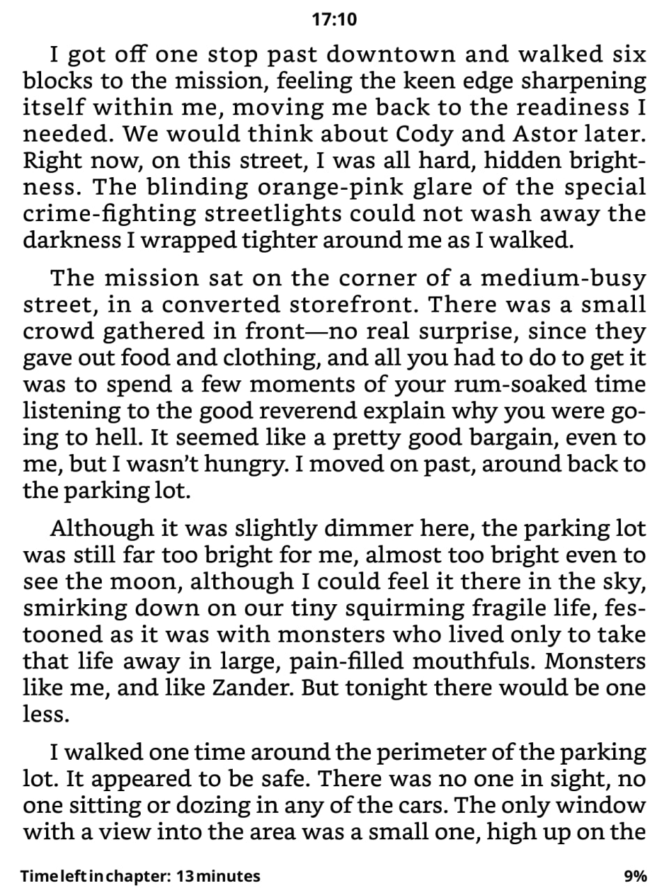

# KOReader Kindle-Style UI

This repository contains two complementary KOReader patches designed to enhance your reading experience.

Adds customizations to KOReader’s footer, transforming the chapter time display to mimic the Kindle style. It shows **"Time left in chapter: X minute(s)"** while reading and **"Chapter completed"** on the last page of each chapter, complete with proper singular/plural usage. Additionally, it introduces margin padding around the footer text for improved readability.

### [Footer Patch – click to download](2-kindle-time-left.lua) 

### [Header Patch – click to download](2-reader-header-centered.lua) (based on [joshuacant's patch](https://github.com/joshuacant/KOReader.patches/blob/main/2-reader-header-centered.lua)).
This patch is a modification of the excellent joshuacant’s reader header-centered patch. It displays the clock centered at the top of the reader screen. The modification adapts the design to fit cohesively with the footer changes provided here, creating a consistent UI layout.

Together, these patches offer a Kindle-inspired layout with time information elegantly placed at the top center and detailed chapter timing and progress at the footer.

  
   
  <em>Result of installing both patches</em>

## Prerequisites

- KOReader installed on your device.
- Minimum KOReader version: 2025.08 or later.

## Installation instructions

1. Install two patches ([check how to install userpatches here](https://koreader.rocks/user_guide/#L2-userpatches))

2. Configure KOReader status bar settings as follows:
   - Navigate to **Status bar → Status bar items**
   - Enable only these three items:
     1. **Progress percentage**
     2. **Time left to finish chapter**
     3. **Dynamic filler**
   - Then go to **Status bar → Configure items**
   - Arrange items in this order:
     1. Time left to finish chapter
     2. Dynamic filler
     3. Progress percentage

3. Additional settings (see screenshot):
   - Items separator: **None**
   - Item symbols: **Compact**
   - Alignment: **Left**
   - Height: **20**
   - Bottom margin: **5**

#### Following these steps will recreate a clean, Kindle-like experience in KOReader for chapter reading time and progress display.

### Additional Information
You can easily customize margins, spacing, padding, and fonts by editing the patch code directly. Adjust the number of spaces or text formatting inside the Lua file to fit your screen and preferences. Restart KOReader after changes to see the effect.

